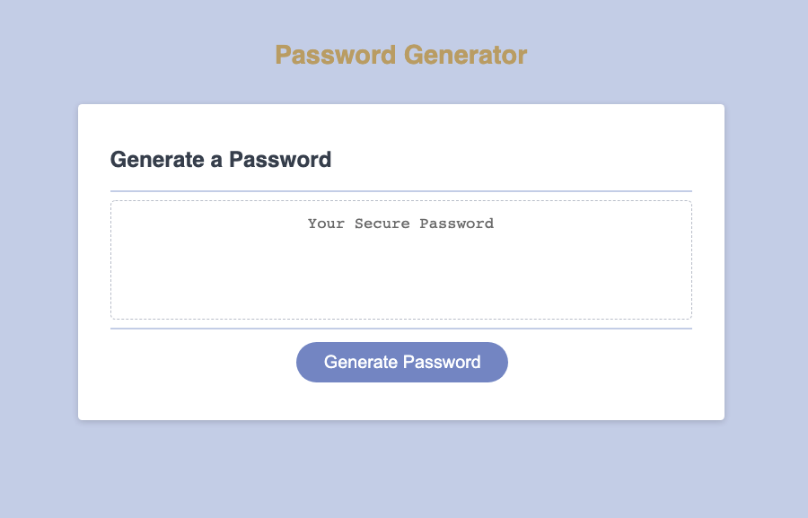

# Password Generator

## Table of Contents

- [Description](#description)
- [Usage](#usage)
- [Web Page](#web-page)

## Description

The Password Generator is an application that enables users to generate a random password based on criteria that they have selected. This will allow the user to create a stronger password that provides greater security

## Usage

a. Head over to the Password Generator webpage:
https://azs6189.github.io/Password-Generator/

b. Click the button to begin generating your password. You will be given a series of prompts for password criteria.

c. Once you complete the prompts, your password will be generated.

## Built With

- HTML
- CSS
- JavaScript

## Web Page

https://azs6189.github.io/Password-Generator/

